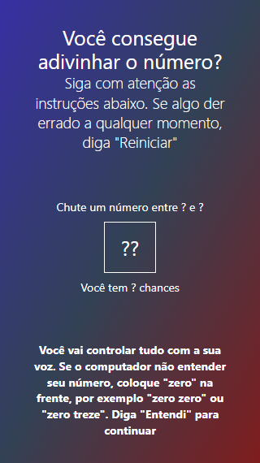
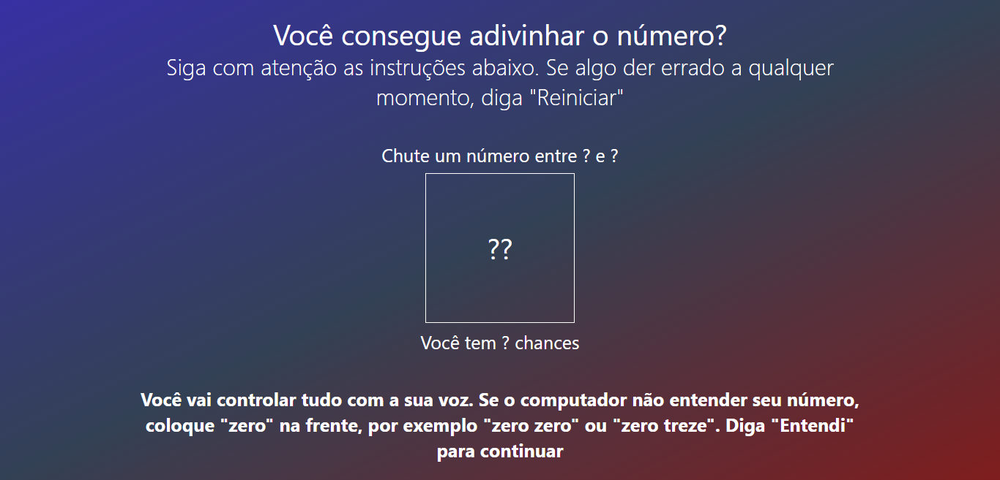

# Fala que eu te escuto

Jogo de adivinhação a partir de comando de voz com regras definidas pelo usuário.

## Construído com:

    

## Funcionalidades

:hammer_and_wrench: Web Speech API; <br>
:police_officer: Validação de entrada do usuário; <br>
:shushing_face: Dicas geradas a partir de 4 parâmetros: se é a primeira tentativa, tentativa anterior, proximidade do alvo e se o chute passou pelo alvo; <br>
:innocent: Loader para melhorar a experiência do usuário; <br>
:iphone: Paradigma Mobile-First; <br>
:fountain_pen: Tipografia fluida;


## Técnicas para prestar atenção

Utilização de seletores CSS para que "Lista chutes: " só apareça quando houver chutes. Combinação de :has, :not, :empty e ::before. Manipulação feita sem JavaScript;

Criação de objeto 'dicas' com 4 parâmetros, possibilitando 10 cenários distintos, e melhorando a legibilidade e manutenção do código;

A API apresentava um problema de retornar números como strings por extenso. Contornei esse problema utilizando um objeto 'numeros' que é varrido pela função 'corrigeNumeros';

Em telas de celular, a leitura de vh é prejudicada pelos controles do navegador, gerando scroll vertical mesmo quando a aplicação é projetada para não ter rolagem. Resolvi esse problema definindo uma variável CSS a partir do JS (linha 18);

A lista de chutes é gerada a partir de um array de chutes. Esse array é ordenado a cada inserção, e a renderização acontece utilizando a função map, que condiciona um espaçamento antes do número a depender se ele é o primeiro do array ou não (linha 242);

## Acesse

<a href="https://adivinhacao-voz-caio.vercel.app/">Jogue clicando aqui</a>.

## Objetivo

O objetivo deste projeto foi criar um jogo utilizando o WebSpeech API, e aprofundar meus conhecimentos em Tailwind. O gatilho para este projeto foi o curso "JavaScript: validações e reconhecimento de voz" da Alura, ministrado pelo Guilherme Lima. O desenvolvimento do projeto, contudo, foi completamente independente do feito pelo instrutor, começando pelo uso do Tailwind, assim como toda a lógica de geração de dicas e validação de dados do usuário.

## Tarefas

- [X] Impedir usuário de inserir palavras que não sejam números
- [X] Permitir que usuário decida quantas chances quer
- [X] Sortear número
- [X] Mostrar as tentativas do usuário na tela
- [X] Estilização das tentativas na tela
- [X] Tratar casos de vitória e derrota
- [X] Validar os chutes do usuario
- [X] Mostrar chutes na tela
- [X] Criação do objeto dicas
- [X] Dar dicas para cada tentativa
- [X] Validar: número maior deve ser maior que o menor
- [X] Validar: Número de chances

## Screenshots
<p align="middle">


</p>

## Exemplos de melhorias realizadas no código

Neste projeto, reutilizei partes de código criado por mim em agosto de 2022, um jogo de adivinhação a parti de dados digitados pelo usuário. Refatorei ele inteiro, e alguns pontos podem interessar a outros desenvolvedores. 

### Exemplo 1
Esse trecho de código:

```
numInicial.innerText = '?';
numFinal.innerText = '?';
qtdChances.innerText = '?';
campoChute.innerText = '?';
```


Virou:
```
[numInicial, numFinal, qtdChances, campoChute].forEach(elemento => elemento.innerText = '?')
```

### Exemplo 2
Esse trecho de código:
```
   if(result ==='reiniciar'){
     etapaJogo = 'inicio';
      instrucao.innerText = 'Você vai controlar tudo com a sua voz. Siga com cuidado as instruções. Se algo der errado diga "Reiniciar". Diga "Entendi" para ir para continuar';
      numInicial.innerText = '?';
      numFinal.innerText = '?';
   }   else if(etapaJogo === 'inicio' && result ==='entendi'){
      etapaJogo = 'menorNumero';
      instrucao.innerText = 'Diga o primeiro número do seu intervalo de adivinhação. Para 0 diga "zero zero" e para 1 dia "zero um"';
   }   else if(etapaJogo === 'menorNumero' && isNumber(result)){
      numInicial.innerText = corrigeNumeros(result);
      etapaJogo = 'maiorNumero';
      instrucao.innerText = 'Diga o segundo número do seu intervalo de adivinhação';
   }   else if(etapaJogo === 'maiorNumero' && isNumber(result)){
      numFinal.innerText = corrigeNumeros(result);
      etapaJogo = 'chances';
      instrucao.innerText = 'Quantas chances para adivinhar você quer?';
   }   else if(etapaJogo === 'chances' && isNumber(result)){
      qtdChancesValor = corrigeNumeros(result);
      etapaJogo = 'confirmar';
      instrucao.innerText = 'Podemos começar o jogo? Diga "agora" para começar';
   }   else if(etapaJogo === 'confirmar' && result==="agora"){
      console.log('Começar jogo')
   } 
```

Foi reestruturado com o paradigma de orientação a objetos:
```
function engrenagemJogo(etapaAtual, palavra){
   if(palavra === "reiniciar"){
      reiniciaJogo();
      return
   }
   const objetoEtapa = etapasJogo.filter(elemento => elemento.etapaJogo === etapaAtual);
   console.log(objetoEtapa);
   if( objetoEtapa[0].condicao(palavra)){
      instrucao.innerText = objetoEtapa[0].instrucao;
      etapaJogo = objetoEtapa[0].proximaEtapa;
      if(objetoEtapa[0].acao){
         objetoEtapa[0].acao(palavra);
      };
   }
}

const etapasJogo = [
   {etapaJogo: 'inicio',
   condicao: (palavra) => palavra === 'entendi',
   acao: '',
   instrucao: 'Diga o primeiro número do seu intervalo de adivinhação. Para 0 diga "zero zero" e para 1 dia "zero um"',
   proximaEtapa: 'menorNumero'
   },
   {etapaJogo: 'menorNumero',
   condicao: (palavra) => isNumber(palavra),
   acao: (palavra) => 
         {
            numInicialInteiro = corrigeNumeros(palavra);
            numInicial.innerText = numInicialInteiro
         },
   instrucao: 'Diga o segundo número do seu intervalo de adivinhação',
   proximaEtapa: 'maiorNumero'
   },
   {etapaJogo: 'maiorNumero',
   condicao: (palavra) => isNumber(palavra) && validaNumeroMaior(palavra),
   acao: (palavra) => 
         {
            numFinalInteiro = corrigeNumeros(palavra);
            numFinal.innerText = numFinalInteiro;
         },
   instrucao: `Quantas chances para adivinhar você quer?`,
   proximaEtapa: 'chances'
   },
   {etapaJogo: 'chances',
   condicao: (palavra) => isNumber(palavra) && validaChances(palavra),
   acao: (palavra) =>
         {
            qtdChancesValor = corrigeNumeros(palavra);
            qtdChances.innerText = qtdChancesValor;
         },
   instrucao: 'Podemos começar o jogo? Diga "agora" para começar',
   proximaEtapa: 'confirmar'
   },
   {etapaJogo: 'confirmar',
   condicao: (palavra) => palavra === 'agora',
   acao: () => sorteiaNumero() ,
   instrucao: 'Pode chutar um número',
   proximaEtapa: 'jogo'
   },
   {etapaJogo: 'jogo',
   condicao: (palavra) => isNumber(palavra) && chuteEValido(palavra),
   acao: (palavra) => {
      const palavraCorrigida = corrigeNumeros(palavra);      
      mostraChuteNaTela(palavraCorrigida);
      acertou(corrigeNumeros(palavraCorrigida)) ? ganhaJogo() : processaErro(palavraCorrigida);
   },
   instrucao: '',
   proximaEtapa: 'jogo'
   },
   {etapaJogo: 'fim',
   condicao: () =>  false,
   acao: () => false,
   instrucao: '',
   proximaEtapa: 'fim'
   }
];
```
